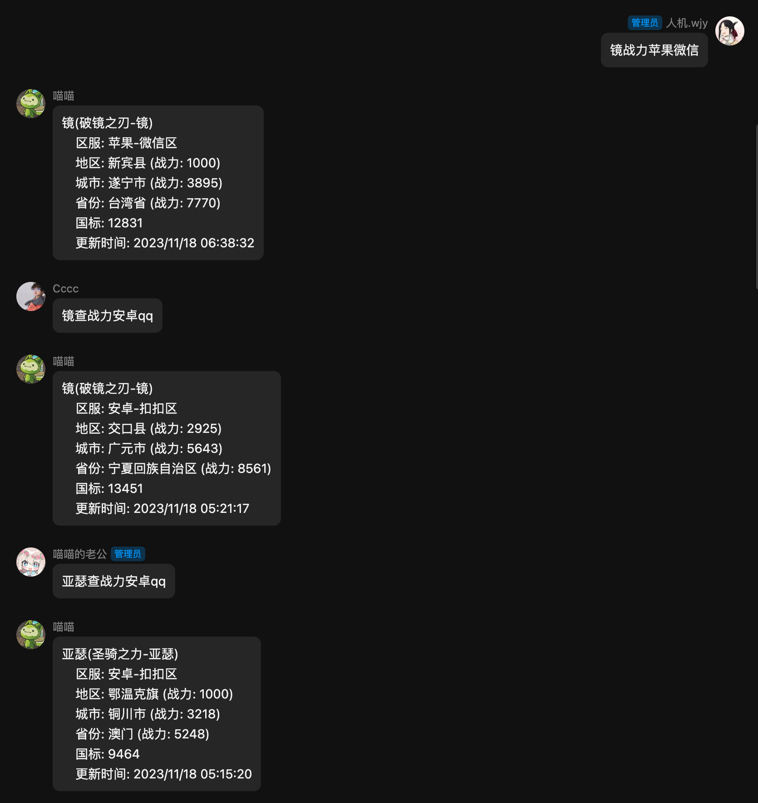

# Honor-Plugin 说明

`honor-plugin`是一个提供王者荣耀战力查询等功能的插件。

## 安装与更新

### 使用 Git 安装

与其他 Yunzai-Bot 插件的安装方法一样, 放在 plugins/目录下, 重启 Yunzai-Bot 后即可使用.

在 Yunzai-Bot 根目录打开终端, 运行如下命令之一即可安装.

```
// 使用Github
git clone --depth=1 https://github.com/Micuks/honor-plugin.git ./plugins/honor-plugin/
pnpm install -P

// 使用Gitee, 当Github访问不通畅的时候推荐使用
git clone --depth=1 https://gitee.com/Micuks/honor-plugin.git ./plugins/honor-plugin/
pnpm install -P
```

## 功能说明

可以查询安卓/iOS 的 QQ/微信英雄最低战力. 更多功能等待更新, 有期待的功能请提 issue.

### #露娜查战力安卓 QQ

以下均是正确的查询语句:

```
#露娜查战力安卓qq
镜查战力iosvx
镜查战力iOS微信
妲己查战力苹果v
#孙悟空战力androidq
```



## 致谢

- 仔细参考了 [Miao-plugin](https://github.com/yoimiya-kokomi/miao-plugin)
- [干货助手](使用了干货助手): 感谢干货助手提供的 API 服务
